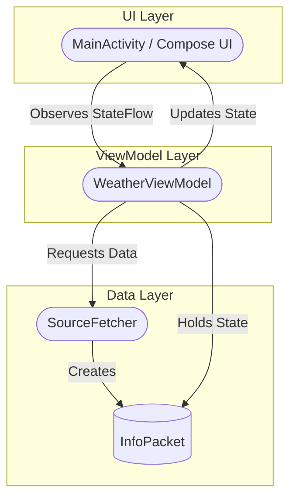
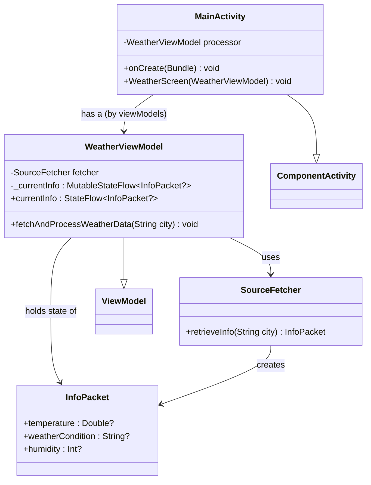
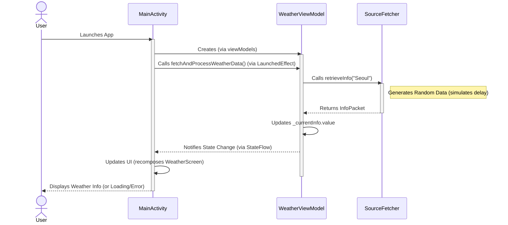

# 엉망진창 날씨 앱 (Sloppy Weather App)

현재 위치(기본값: 서울)의 날씨 정보를 사용자에게 명확하게 보여주는 간단한 Android 앱입니다.

## 주요 기능

- 앱 실행 시 자동으로 날씨 데이터를 비동기적으로 로딩하고 화면에 표시합니다.
- 표시 정보:
    - 현재 온도 (섭씨, 소수점 첫째 자리까지)
    - 날씨 상태 (예: Sunny, Cloudy, Rainy, 또는 N/A)
    - 현재 습도 (%, 또는 N/A)
- 데이터 로딩 중에는 로딩 상태를 표시합니다.
- 오류 발생 시 로딩 상태를 표시합니다 (현재 구현).

## 사용 기술

- **언어:** Kotlin
- **UI:** Jetpack Compose
- **아키텍처:** MVVM (Model-View-ViewModel)
- **비동기 처리:** Kotlin Coroutines (viewModelScope)
- **상태 관리:** StateFlow
- **데이터:** 내부적으로 시뮬레이션된 날씨 데이터 사용 (`SourceFetcher`)

## 아키텍처 (High Level)

이 앱은 MVVM 아키텍처 패턴을 따릅니다.



- **UI Layer (`MainActivity.kt`):** Jetpack Compose를 사용하여 사용자 인터페이스를 구성하고, `WeatherViewModel`의 상태를 관찰하여 UI를 업데이트합니다.
- **ViewModel Layer (`WeatherViewModel.kt`):** UI에 필요한 데이터를 관리하고, 데이터 로딩 및 처리 로직을 수행합니다. `SourceFetcher`를 통해 데이터를 요청하고, 결과를 `StateFlow`를 통해 UI에 노출합니다.
- **Data Layer (`SourceFetcher.kt`, `InfoPacket.kt`):** 날씨 데이터를 제공(시뮬레이션)하고 데이터 구조(`InfoPacket`)를 정의합니다.

## 클래스 다이어그램



## 시퀀스 다이어그램 (앱 실행 시 날씨 정보 로딩)



## 유스케이스 다이어그램

```mermaid
usecaseDiagram
    actor User
    rectangle "Sloppy Weather App" {
        User -- (View Current Weather)
    }
```

## 프로젝트 구조

```
.
├── app
│   ├── src
│   │   ├── main
│   │   │   ├── java/com/example/sloppyweather
│   │   │   │   ├── data                # 데이터 관련 클래스
│   │   │   │   │   ├── InfoPacket.kt   # 날씨 정보 데이터 클래스
│   │   │   │   │   └── SourceFetcher.kt  # 데이터 소스 (시뮬레이션)
│   │   │   │   └── ui                  # UI 및 ViewModel 관련 클래스
│   │   │   │       ├── MainActivity.kt   # 메인 액티비티 및 Composable UI
│   │   │   │       └── WeatherViewModel.kt # ViewModel
│   │   │   └── res                 # 리소스 파일 (레이아웃, 드로어블 등)
│   │   └── AndroidManifest.xml     # 앱 매니페스트
│   └── build.gradle              # 앱 모듈 빌드 스크립트
├── build.gradle                  # 프로젝트 레벨 빌드 스크립트
├── settings.gradle               # Gradle 설정
└── prd_weather.md                # 프로젝트 요구사항 문서
```

## 빌드 및 실행

1.  Android Studio에서 프로젝트를 엽니다.
2.  기본 실행 구성을 선택합니다 (일반적으로 `app`).
3.  에뮬레이터 또는 실제 기기에서 앱을 실행합니다.

## 알려진 문제점 및 개선 사항

- 현재 오류 발생 시 별도의 오류 메시지 대신 로딩 상태가 계속 표시됩니다.
- 도시 이름이 `WeatherViewModel` 내에서 하드코딩되어 있습니다 (`fetchAndProcessWeatherData` 호출 시). 사용자 입력이나 위치 기반 서비스 연동이 필요합니다.
- `SourceFetcher`는 실제 네트워크 호출 없이 랜덤 데이터를 생성합니다. 실제 API 연동이 필요합니다.
- UI 디자인이 매우 기본적인 상태입니다. 아이콘 추가, 색상 및 레이아웃 개선 등이 필요합니다.
- 테스트 코드가 없습니다. 유닛 테스트 및 UI 테스트 추가가 필요합니다.
